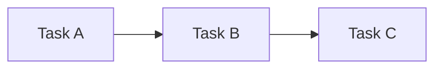
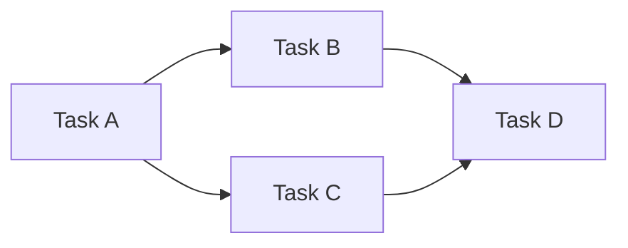
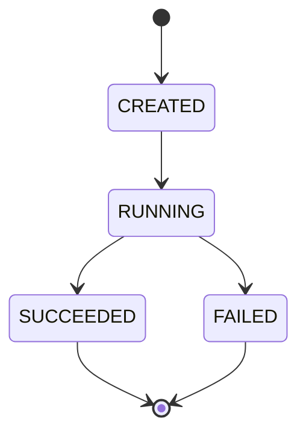
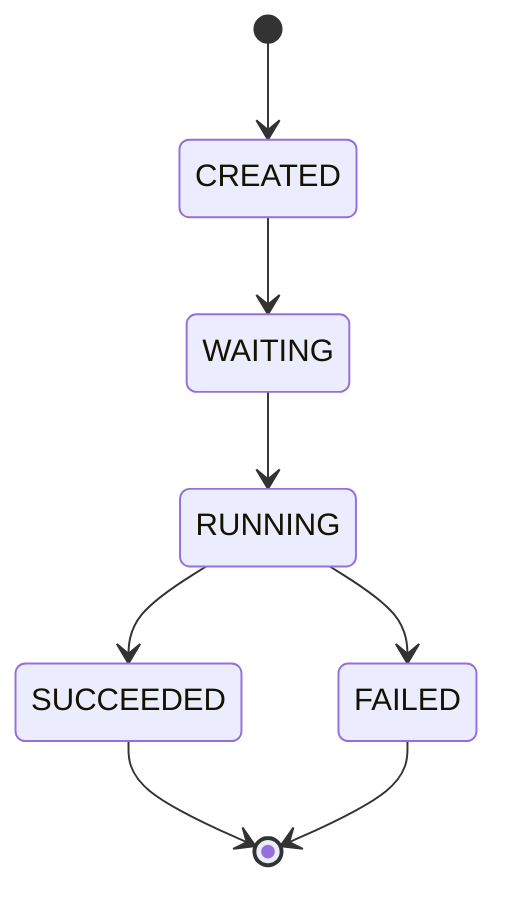
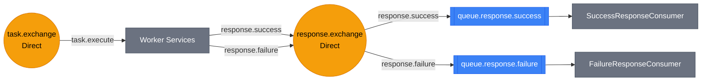
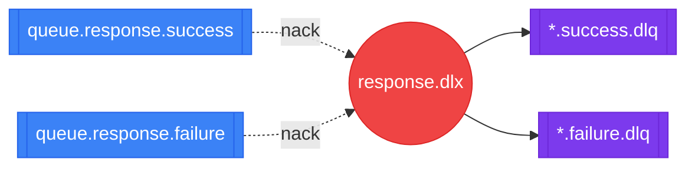

# Orchestrator Module

A workflow orchestrator that executes tasks defined as a DAG (Directed Acyclic Graph).
Each task is dispatched to worker services via RabbitMQ. Workers report success or failure asynchronously.
The orchestrator tracks completion counts, manages state transitions, and triggers downstream tasks when dependencies are met.

## 1. Workflow DAG Examples

#### Linear

#### Diamond

Task D waits until both B and C succeed. If B or C fails, D is skipped.

## 2. Workflow State Machine

## 3. Task (Node) State Machine

- **CREATED** → **WAITING**: Workflow started, task registered in DAG
- **WAITING** → **RUNNING**: All parent tasks succeeded
- **RUNNING** → **SUCCEEDED**: `completedCount >= expectedCount`
- **RUNNING** → **FAILED**: Failure response received, propagates to downstream tasks

## 4. RabbitMQ Topology

> **Legend:** 
> Yellow circle = Exchange 
> Blue box = Queue 
> Grey box = Consumer 
> Arrow labels = routing key 

#### task.exchange + response.exchange

#### Dead Letter Queues

