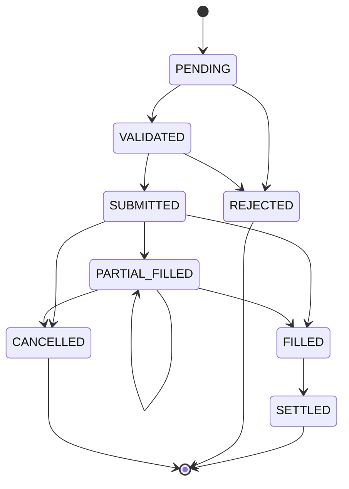
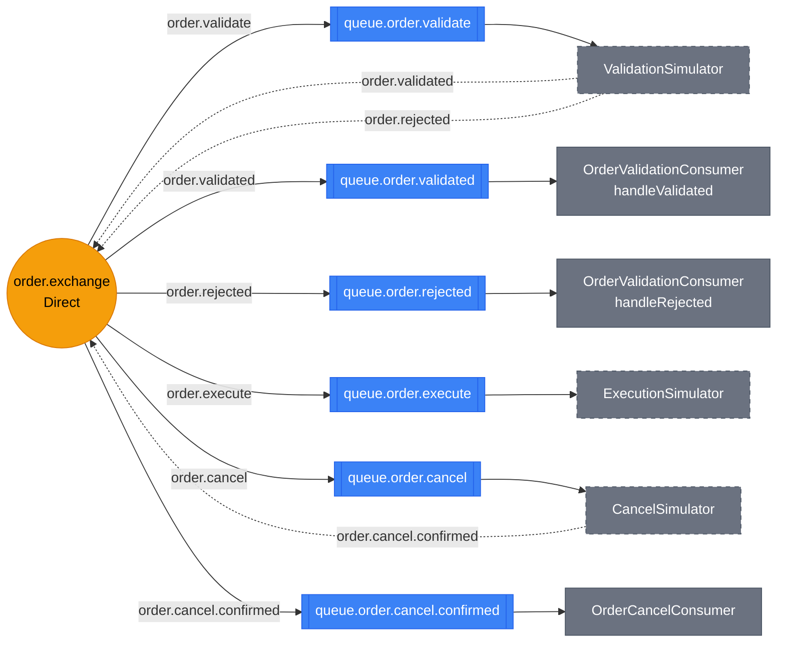
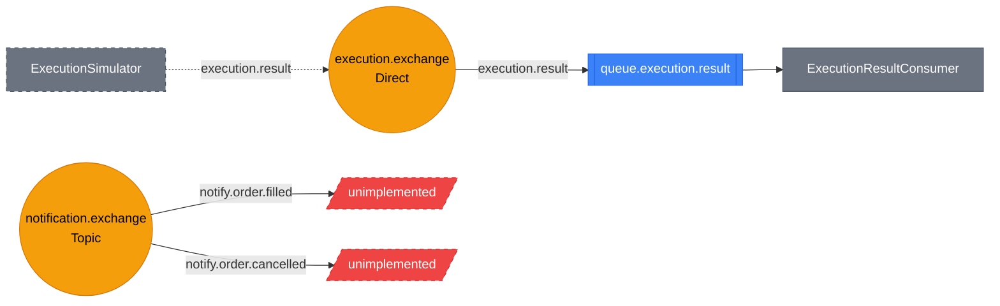
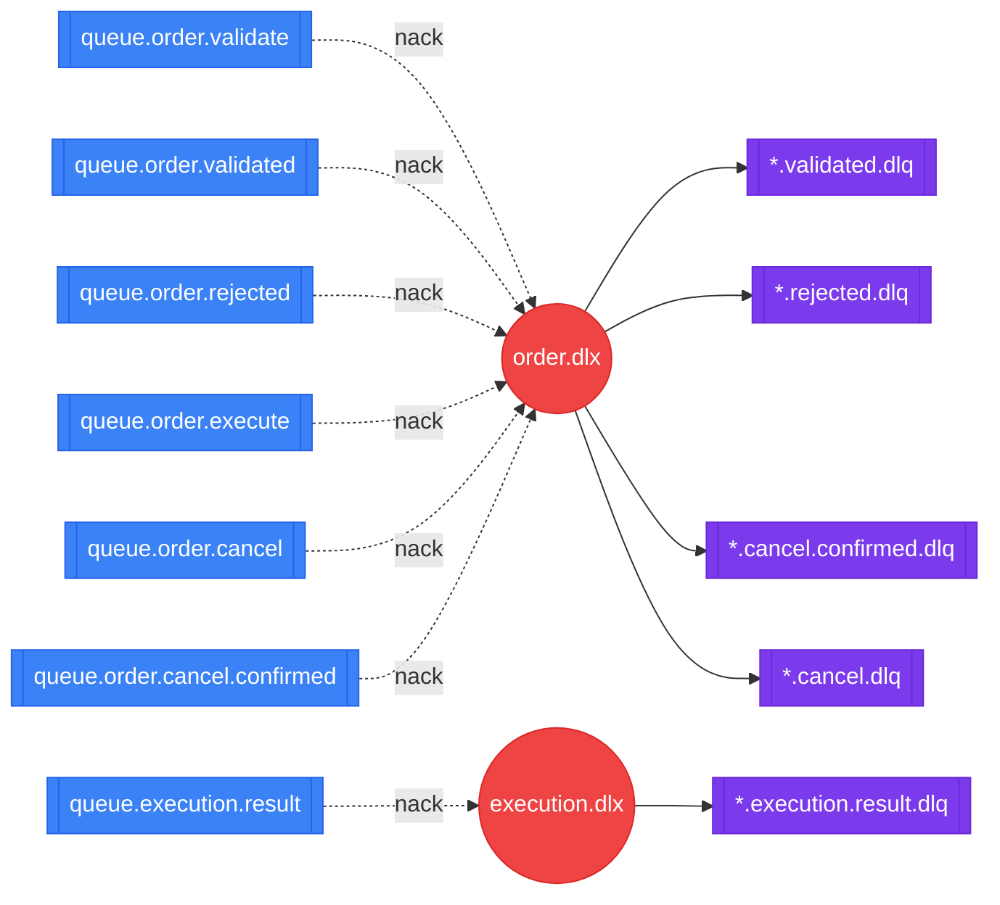

# Security Module

## 1. Order State Machine

## 2. RabbitMQ Topology

> **Legend:** 
> Yellow circle = Exchange 
> Blue box = Queue  
> Grey box = Consumer 
> Arrow labels = routing key  
> Dotted arrows = simulator (local only) 

#### order.exchange

#### execution.exchange + notification.exchange

### Dead Letter Queues

Failed messages (nack, no requeue) are routed to dead letter exchanges for inspection.

